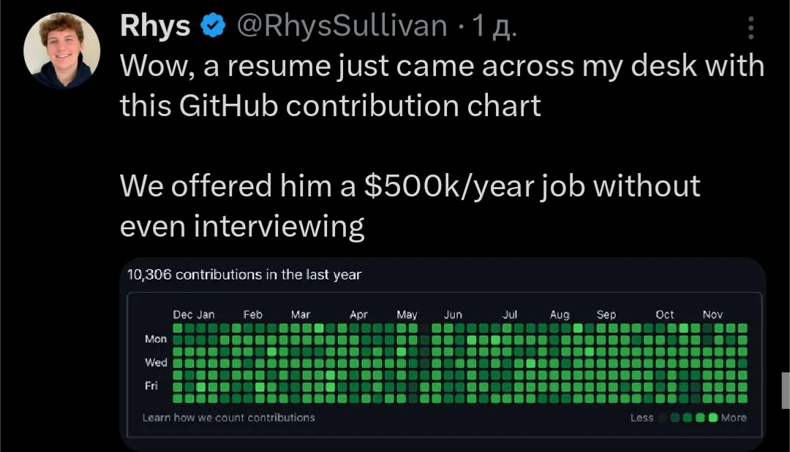

# GitHub Commit History Bot

## Overview

A few months ago, I came across a post where someone claimed that they were offered $500K just for having a GitHub profile with an impressive commit history. Of course, we know GitHub commit history can easily be faked. In fact, when I was working as a freelancer, I used to backdate commits because I completed tasks in a few hours that were originally estimated to take much longer (e.g., 5 SPs). 

Anyway, the moral of the story is that I wanted to create a bot that automates the generation of fake commit histories, and that's what this project is all about.



## Table of Contents

1. [How to Use This Repo](#how-to-use-this-repo)
2. [Prerequisites](#prerequisites)
3. [Configuration Parameters](#configuration-parameters)
4. [FAQ](#faq)

---

## How to Use This Repo

Follow the steps below to generate your own fake commit history:

### Step-by-Step Guide:
1. **Clone the Repository**:
   Clone this repository to your local machine using the following command:
   ```bash
   git clone https://github.com/your-username/repository-name.git
   ```
   
2. **Configure the Bot**:
   Open `app.config` and set the following parameters (explained below):
   - `org.liberty.gchb.path`: Path to your local GitHub repository.
   - `org.liberty.gchb.start-date`: The start date for your commit history.
   - `org.liberty.gchb.end-date`: The end date for your commit history.

3. **Create a New GitHub Repository**:
   Go to GitHub and create a new repository. This will be the target for the fake commit history.

4. **Checkout the New Repository**:
   Clone your newly created GitHub repository and navigate to it in the terminal:
   ```bash
   git clone https://github.com/your-username/new-repo.git
   cd new-repo
   ```

5. **Set Git Configuration**:
   Set your Git username and email to match your GitHub account:
   ```bash
   git config user.name "YOUR_GIT_USERNAME"
   git config user.email "YOUR_EMAIL"
   ```

6. **(Optional) Switch to a Different Branch**:
   If you want to generate commit history on a branch other than `main`, switch to it:
   ```bash
   git checkout -b new-branch
   ```

7. **Run the Bot**:
   Run the Java program to start generating commits:
   ```bash
   java -cp target/your-jar-file.jar org.liberty.gchb.Main
   ```

---

## Prerequisites

Before running the bot, ensure you have the following installed:

1. **Git**
2. **JDK 17**
3. **Shell/Terminal**: Use `sh` or Git Bash (on Windows) for running scripts internally.

---

## Configuration Parameters

In the `app.config` file, you can configure the following parameters to customize the commit history generation:

| Parameter                             | Description |
|---------------------------------------|-------------|
| `org.liberty.gchb.path`               | Path to your local Git repository. (e.g., `/home/dev/personal/fake-git-commit-test`) |
| `org.liberty.gchb.start-date`         | The start date for commit history (e.g., `2023-01-01`). |
| `org.liberty.gchb.end-date`           | The end date for commit history (e.g., `2023-12-31`). |
| `org.liberty.gchb.start-time`         | The start time for each commit (e.g., `08:00`). |
| `org.liberty.gchb.end-time`           | The end time for each commit (e.g., `18:00`). |
| `org.liberty.gchb.commit-type`        | Type of commits: `EVERYDAY`, `ONLY_WEEKEND`, or `ONLY_WORKDAY`. |
| `org.liberty.gchb.min-commit-per-day` | Minimum number of commits per day. |
| `org.liberty.gchb.max-commit-per-day` | Maximum number of commits per day. |
| `org.liberty.gchb.messages`           | A list of commit messages (separate by `|`). Example: `Message 1 | Message 2`. |

---

## FAQ

### Why did you create this as a Java project instead of a simple Python script?

While it’s true that a simple script or shell file would have sufficed, I chose to implement it as a Java project to practice design patterns, specifically the Adapter pattern. It also allows me to demonstrate the flexibility and scalability of the solution.

### Why are commits being pushed after each commit is generated?

While it’s not strictly necessary to push after every commit, when I initially built the project, I wasn’t sure how many files might be generated, especially if a long history (e.g., from 1800 to the present day) is created. To be safe, I decided to push commits to avoid any potential issues with large histories.

### How can I use my own commit messages?

You can modify the `org.liberty.gchb.messages` parameter in `app.config` to add your own commit messages. Simply separate multiple messages with a pipe (`|`) symbol, like so:
```
"Initial commit | Bug fix | Added feature X | Optimized code"
```

### Can I use this to generate commits for an existing GitHub repository?

Yes, you can. Just configure the bot to point to the repository you want to modify, and it will generate the fake commits in that repository.

Happy coding.
